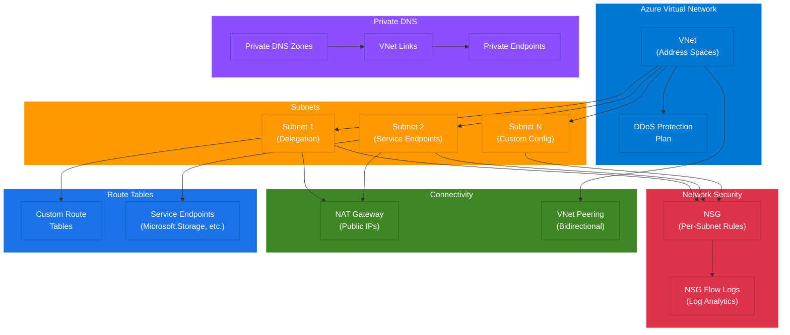

# Terraform Azure Virtual Network Module

A comprehensive Terraform module for deploying Azure Virtual Networks with subnet delegation, service endpoints, NAT Gateway, DDoS Protection, Network Security Groups, NSG flow logs, and Private DNS Zones.

## Architecture

```
                        +---------------------------+
                        |   Azure Virtual Network   |
                        |   (address_spaces)        |
                        |                           |
                        |  +--- DDoS Protection -+  |
                        |  |    Plan (optional)   |  |
                        |  +---------------------+  |
                        +---------------------------+
                                    |
            +-----------------------+-----------------------+
            |                       |                       |
    +-------v-------+      +-------v-------+      +-------v-------+
    |   Subnet 1    |      |   Subnet 2    |      |   Subnet N    |
    | (delegation,  |      | (service      |      | (custom       |
    |  endpoints)   |      |  endpoints)   |      |  config)      |
    +-------+-------+      +-------+-------+      +-------+-------+
            |                       |                       |
    +-------v-------+      +-------v-------+      +-------v-------+
    |     NSG       |      |     NSG       |      |     NSG       |
    | (per-subnet   |      | (per-subnet   |      | (per-subnet   |
    |  rules)       |      |  rules)       |      |  rules)       |
    +-------+-------+      +-------+-------+      +-------+-------+
            |                       |                       |
            +-----------+-----------+-----------+-----------+
                        |                       |
                +-------v-------+       +-------v-----------+
                |  NAT Gateway  |       | Private DNS Zones |
                |  (optional)   |       | (optional)        |
                |  + Public IPs |       | + VNet Links      |
                +---------------+       +-------------------+
                                                |
                                        +-------v-----------+
                                        | Private Endpoints |
                                        | (submodule)       |
                                        +-------------------+

    +-------------------+       +-------------------+
    |  VNet Peering     |       |  NSG Flow Logs    |
    |  (submodule)      |       |  (optional)       |
    +-------------------+       +-------------------+
```

### Component Diagram



## Features

- **Virtual Network** with multiple address spaces and custom DNS servers
- **Subnets** with configurable address prefixes, service endpoints, and delegation
- **Network Security Groups** per subnet with flexible rule definitions
- **NAT Gateway** with configurable public IP count and idle timeout
- **DDoS Protection** plan association
- **NSG Flow Logs** with Log Analytics traffic analytics integration
- **Private DNS Zones** with automatic VNet linking
- **Submodules** for subnets, private endpoints, and VNet peering

## Usage

### Basic

```hcl
module "vnet" {
  source  = "kogunlowo123/virtual-network/azure"
  version = "~> 1.0"

  name                = "my-vnet"
  resource_group_name = "my-resource-group"
  location            = "eastus"
  address_spaces      = ["10.0.0.0/16"]

  subnets = {
    "frontend" = {
      address_prefixes = ["10.0.1.0/24"]
    }
    "backend" = {
      address_prefixes = ["10.0.2.0/24"]
    }
  }

  tags = {
    Environment = "dev"
  }
}
```

### With NAT Gateway and NSG Rules

```hcl
module "vnet" {
  source  = "kogunlowo123/virtual-network/azure"
  version = "~> 1.0"

  name                = "prod-vnet"
  resource_group_name = "prod-rg"
  location            = "eastus"
  address_spaces      = ["10.0.0.0/16"]

  subnets = {
    "web" = {
      address_prefixes  = ["10.0.1.0/24"]
      service_endpoints = ["Microsoft.Storage"]
      nsg_rules = [
        {
          name                   = "allow-https"
          priority               = 100
          direction              = "Inbound"
          access                 = "Allow"
          protocol               = "Tcp"
          destination_port_range = "443"
        }
      ]
    }
    "app" = {
      address_prefixes = ["10.0.2.0/24"]
      delegation = {
        name                    = "app-service"
        service_delegation_name = "Microsoft.Web/serverFarms"
        actions                 = ["Microsoft.Network/virtualNetworks/subnets/action"]
      }
    }
  }

  enable_nat_gateway          = true
  nat_gateway_public_ip_count = 2

  tags = {
    Environment = "production"
  }
}
```

### With Private DNS Zones

```hcl
module "vnet" {
  source  = "kogunlowo123/virtual-network/azure"
  version = "~> 1.0"

  name                = "hub-vnet"
  resource_group_name = "hub-rg"
  location            = "eastus"
  address_spaces      = ["10.0.0.0/16"]

  subnets = {
    "private-endpoints" = {
      address_prefixes = ["10.0.4.0/24"]
    }
  }

  private_dns_zones = [
    {
      name = "privatelink.blob.core.windows.net"
    },
    {
      name         = "privatelink.database.windows.net"
      linked_vnets = ["/subscriptions/.../spoke-vnet-id"]
    }
  ]
}
```

## Requirements

| Name | Version |
|------|---------|
| [terraform](#requirement\_terraform) | >= 1.5.0 |
| [azurerm](#requirement\_azurerm) | >= 3.80.0 |

## Providers

| Name | Version |
|------|---------|
| [azurerm](#provider\_azurerm) | >= 3.80.0 |

## Inputs

| Name | Description | Type | Default | Required |
|------|-------------|------|---------|----------|
| `name` | The name of the virtual network | `string` | n/a | yes |
| `resource_group_name` | The name of the resource group | `string` | n/a | yes |
| `location` | The Azure region for deployment | `string` | n/a | yes |
| `address_spaces` | List of CIDR blocks for the VNet | `list(string)` | n/a | yes |
| `dns_servers` | Custom DNS server IPs | `list(string)` | `[]` | no |
| `subnets` | Map of subnet configuration objects | `map(object)` | `{}` | no |
| `enable_nat_gateway` | Create a NAT Gateway | `bool` | `false` | no |
| `nat_gateway_idle_timeout` | NAT Gateway idle timeout (minutes) | `number` | `4` | no |
| `nat_gateway_public_ip_count` | Number of public IPs for NAT Gateway | `number` | `1` | no |
| `enable_ddos_protection` | Enable DDoS Protection | `bool` | `false` | no |
| `ddos_protection_plan_id` | DDoS Protection Plan ID | `string` | `null` | no |
| `enable_flow_logs` | Enable NSG flow logs | `bool` | `false` | no |
| `network_watcher_name` | Network Watcher name for flow logs | `string` | `null` | no |
| `log_analytics_workspace_id` | Log Analytics Workspace ID | `string` | `null` | no |
| `private_dns_zones` | List of private DNS zone objects | `list(object)` | `[]` | no |
| `tags` | Tags to assign to all resources | `map(string)` | `{}` | no |

### Subnet Object Structure

```hcl
{
  address_prefixes  = list(string)           # Required
  service_endpoints = optional(list(string)) # e.g., ["Microsoft.Storage"]
  delegation = optional(object({
    name                    = string
    service_delegation_name = string
    actions                 = optional(list(string))
  }))
  nsg_rules = optional(list(object({
    name                       = string
    priority                   = number
    direction                  = string  # "Inbound" or "Outbound"
    access                     = string  # "Allow" or "Deny"
    protocol                   = string  # "Tcp", "Udp", "Icmp", or "*"
    source_port_range          = optional(string, "*")
    destination_port_range     = optional(string, "*")
    source_address_prefix      = optional(string, "*")
    destination_address_prefix = optional(string, "*")
  })))
}
```

## Outputs

| Name | Description |
|------|-------------|
| `vnet_id` | The ID of the virtual network |
| `vnet_name` | The name of the virtual network |
| `vnet_address_space` | The address space of the virtual network |
| `vnet_guid` | The GUID of the virtual network |
| `subnet_ids` | Map of subnet names to their resource IDs |
| `subnet_address_prefixes` | Map of subnet names to their address prefixes |
| `nsg_ids` | Map of subnet names to their NSG resource IDs |
| `nat_gateway_id` | The ID of the NAT Gateway |
| `nat_gateway_public_ips` | Public IPs of the NAT Gateway |
| `private_dns_zone_ids` | Map of DNS zone names to their resource IDs |
| `resource_group_name` | The name of the resource group |
| `location` | The Azure region |

## Submodules

| Module | Description |
|--------|-------------|
| [subnet](./modules/subnet/) | Standalone subnet with NSG and delegation |
| [private-endpoint](./modules/private-endpoint/) | Private Endpoint with DNS zone integration |
| [vnet-peering](./modules/vnet-peering/) | Bidirectional VNet peering |

## Examples

- [Basic](./examples/basic/) - Simple VNet with two subnets
- [Advanced](./examples/advanced/) - VNet with NSGs, NAT Gateway, and delegated subnets
- [Complete](./examples/complete/) - Full-featured deployment with all options enabled

## Azure References

- [Azure Virtual Network documentation](https://learn.microsoft.com/en-us/azure/virtual-network/virtual-networks-overview)
- [Azure Subnet delegation](https://learn.microsoft.com/en-us/azure/virtual-network/subnet-delegation-overview)
- [Azure NAT Gateway](https://learn.microsoft.com/en-us/azure/nat-gateway/nat-overview)
- [Azure DDoS Protection](https://learn.microsoft.com/en-us/azure/ddos-protection/ddos-protection-overview)
- [Azure NSG flow logs](https://learn.microsoft.com/en-us/azure/network-watcher/nsg-flow-logs-overview)
- [Azure Private DNS zones](https://learn.microsoft.com/en-us/azure/dns/private-dns-overview)
- [Azure Private Endpoints](https://learn.microsoft.com/en-us/azure/private-link/private-endpoint-overview)
- [Azure VNet peering](https://learn.microsoft.com/en-us/azure/virtual-network/virtual-network-peering-overview)

## Contributing

Contributions are welcome. Please open an issue first to discuss what you would like to change.

## License

This project is licensed under the MIT License - see the [LICENSE](LICENSE) file for details.
